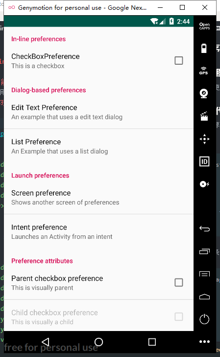
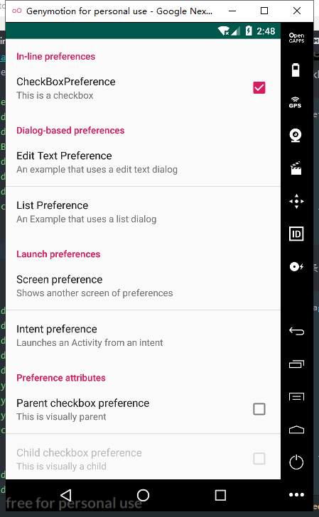
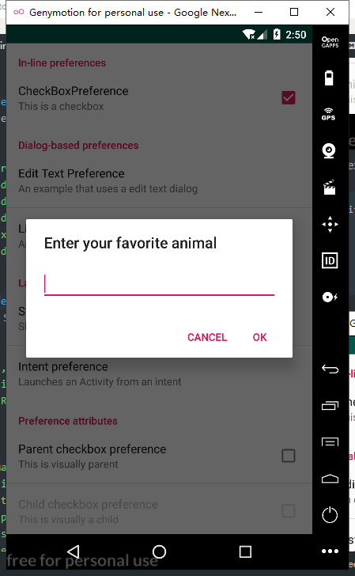
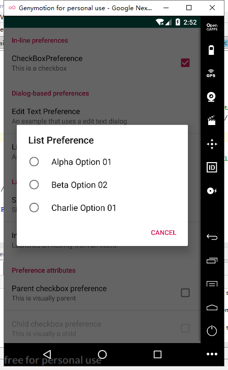
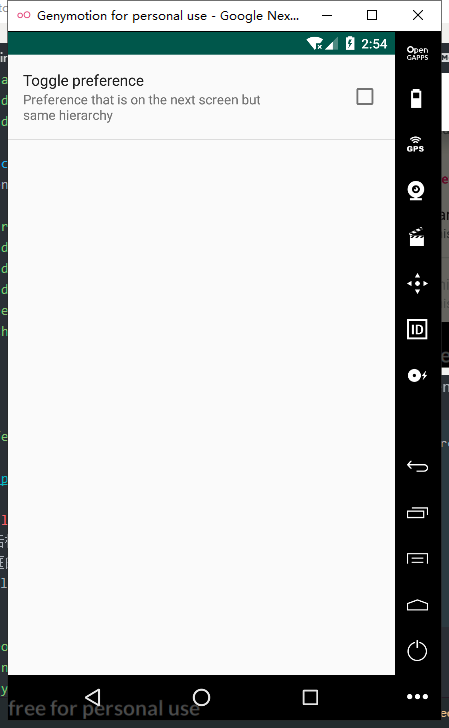
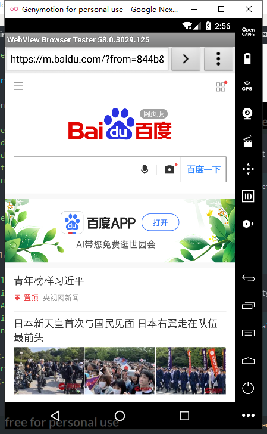
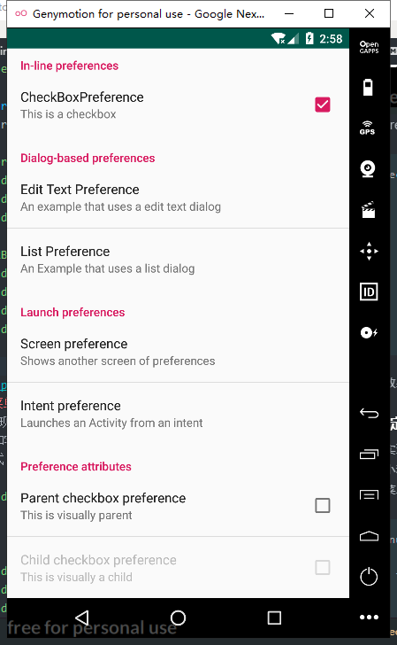
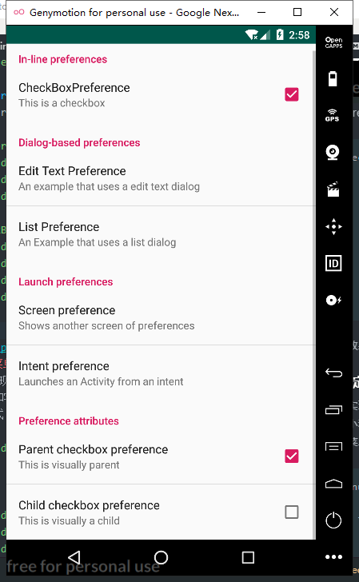

# Read Me

### 程序：Setting_Activity

#### 一、程序功能
&emsp;&emsp;使用PrefereceFragment实现设置页面
#### 二、代码实现

整体界面：  
     
CheckBoxPreference:  
```
<PreferenceCategory
        android:key="In-line preferences"
        android:title="In-line preferences">
        <CheckBoxPreference
            android:key="CheckBoxPreference"
            android:summary="This is a checkbox"
            android:title="CheckBoxPreference"/>
    </PreferenceCategory>

```
  
EditTextPreference:

```
<EditTextPreference
            android:key="EditTextPreference"
            android:title="Edit Text Preference"
            android:summary="An example that uses a edit text dialog"
            android:dialogTitle="Enter your favorite animal"/>
```
  
ListPreference：
```
<ListPreference
            android:key="ListPreference"
            android:title="List Preference"
            android:summary="An Example that uses a list dialog"
            android:entries="@array/lists"
            android:entryValues="@array/lists"/>
```
  
Screen preference：
```
 <PreferenceScreen
            android:key="Screen preference"
            android:title="Screen preference"
            android:summary="Shows another screen of preferences">
            <CheckBoxPreference
                android:key="Toggle preference"
                android:title="Toggle preference"
                android:summary="Preference that is on the next screen but same hierarchy" />
        </PreferenceScreen>
```
  

Intent preference：
```
<PreferenceScreen
            android:title="Intent preference"
            android:summary="Launches an Activity from an intent" >
            <intent
                android:action="android.intent.action.VIEW"
                android:data="http://www.baidu.com/"/>
        </PreferenceScreen>
```
  
Preference attributes：
```
<CheckBoxPreference
            android:key="Parent_checkbox_preference"
            android:title="Parent checkbox preference"
            android:summary="This is visually parent" />

        <CheckBoxPreference
            android:dependency="Parent_checkbox_preference"
            android:title="Child checkbox preference"
            android:key="child_checkbox_preference"
            android:summary="This is visually a child" />
```
  

